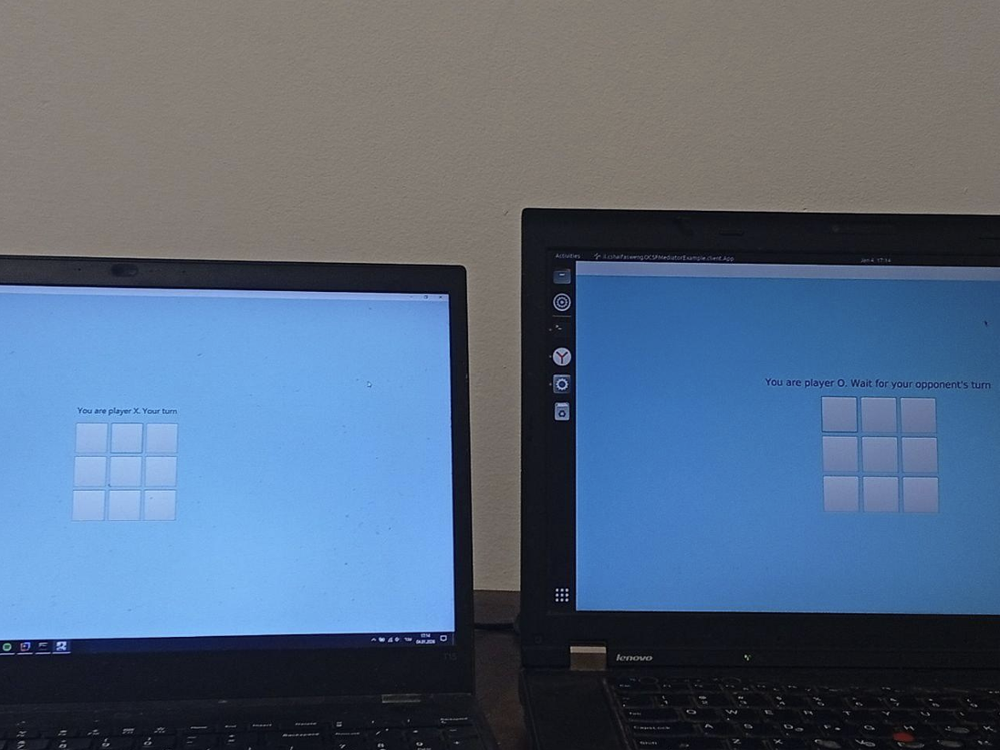
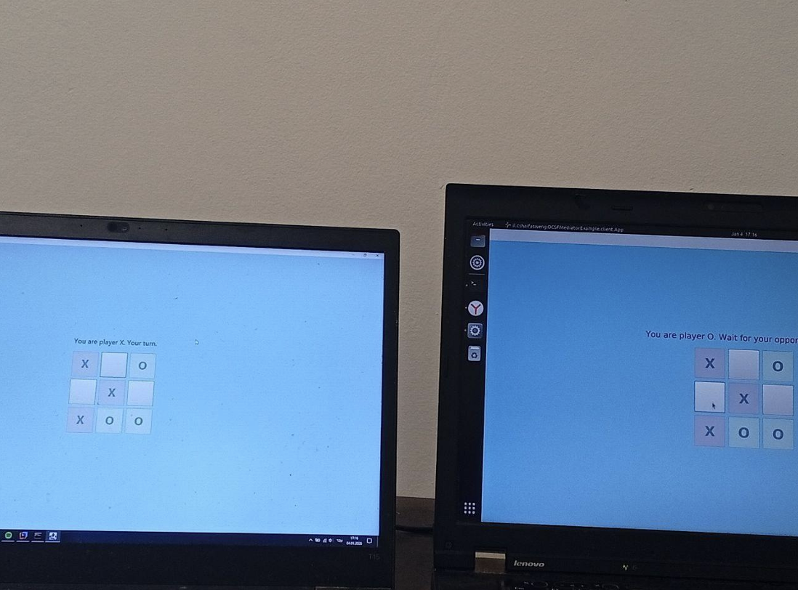

# Lab 7 Report - Online Tic-Tac-Toe (OCSF)

**Submitted by:**
* Roni Amir (319042701)
* Leonid Hirsch (345931521)

---

## Implementation and Synchronization
The project is based on a **Client-Server** architecture utilizing the **OCSF** framework. The implementation focuses on managing the game state on the server side and updating clients in real-time.

### Role Assignment and Turn Synchronization
To address the uncertainty regarding player identity at the start of the game, we implemented a "Handshake" mechanism:

1. **Initial Connection:** The client launches in a "Waiting for opponent" state, with the game board locked.
2. **Role Assignment:** Only after the second player connects, the server randomly assigns roles ('X' and 'O') and sends a specific message to each client (`ROLE:X` or `ROLE:O`).
3. **Turn Management:** The server sends a `TURN` message indicating the active player. On the client side, the following check is performed:
   - If the turn sent by the server matches the player's assigned role (`myRole == currentTurn`), the board is unlocked for input.
   - Otherwise, the board remains locked, and the status updates to "Opponent's Turn".

This mechanism ensures complete synchronization and prevents scenarios where a player moves out of turn or both players believe they hold the same symbol.

---

## Execution Guide
The executable JAR files are located in the Repository at the following paths:
* **Server:** `server/target/server-0.0.1-SNAPSHOT-jar-with-dependencies.jar`
* **Client:** `client/target/client-0.0.1-SNAPSHOT.jar`

### 1. Running the Server
Open a terminal (CMD/PowerShell) in the `server/target` directory and run:
```bash
java -jar server-0.0.1-SNAPSHOT-jar-with-dependencies.jar
```
#### 2. Running the Clients (Two Players)
Open two additional terminal windows in the client/target directory and run the following command in each:
```bash
java -jar client-0.0.1-SNAPSHOT.jar
```


